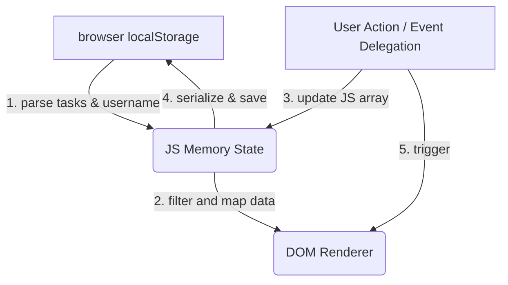

# TaskFlow — Task Tracker

A client-side task management board built using clean, vanilla JavaScript, CSS, and HTML. TaskFlow is designed as a lightweight, zero-dependency Kanban board that runs entirely in the browser, storing data locally via the Web Storage API (`localStorage`).

**Live site:** [task-tracker-umber-three.vercel.app](https://task-tracker-umber-three.vercel.app/)

---

## 1. About the Project (Interview Summary)
*This project is designed to showcase core web fundamentals (HTML5, CSS3, ES5/ES6 vanilla JS) without relying on heavy frontend frameworks or build steps.*

> TaskFlow is a client-side task tracker I built as a web technology project. It's a Kanban board — three columns for To Do, In Progress, and Done — where users can create tasks with titles, deadlines, priorities, and categories, then move them through the workflow.
>
> The core technical decisions: I used vanilla JavaScript with no frameworks, which let me keep the project at three files (HTML, CSS, JS) with zero build step. Data persistence uses the browser's localStorage API — tasks are serialized as JSON and re-parsed on page load. The rendering approach is a simple "clear and rebuild" cycle: every time the task array changes, I wipe the column DOM and rebuild all task cards from the array. This is intentionally naive — for a few dozen tasks the performance is fine, and it avoids the complexity of a virtual DOM diffing system.
>
> The main tradeoff I chose was localStorage over a backend database. This means the app works instantly with no server, no auth, and no hosting cost beyond static hosts like Vercel or GitHub Pages — but tasks don't sync across devices. For a personal task tracker that's an acceptable limitation, and I documented it clearly in the README.

---

## 2. Technical Architecture & Data Flow

TaskFlow follows a simple **Model-View-Controller (MVC) adjacent** structural pattern implemented entirely client-side:



1. **State Management (Model):** 
   - Core state resides in a local `tasks` array containing objects with parameters: `id` (timestamp string), `title` (string), `category` (string), `priority` (string), `dueDate` (string), `description` (string), and `status` (`'todo'`, `'in-progress'`, or `'done'`).
   - Syncs to browser storage via `localStorage.setItem('taskflow_tasks', JSON.stringify(tasks))`.

2. **Rendering Engine (View):**
   - The application employs a unidirectional "render-from-scratch" design loop. Whenever task additions, state movements, or edits occur, the columns are wiped (`innerHTML = ''`) and repopulated based on the active state.
   - Filters (category, search string, due dates) are applied during the mapping process.

3. **Event System (Controller):**
   - **Event Delegation Pattern:** Rather than attaching individual event listeners to every task card (which would lead to memory leaks or require manual re-binding on every render cycle), a single global listener is registered on `document`. 
   - This listener captures bubbling click events from elements containing `data-action` and `data-id` attributes, processing all delete, edit, and move actions centrally.

---

## 3. Tech Stack

- **HTML5** — Semantic markup, inline SVGs for rendering resolution-independent vector icons.
- **CSS3 Custom variables** — A custom design system built around a slate-purple theme using native CSS variables (`--primary`, `--bg`, etc.) and CSS transitions for micro-animations (card hover transitions, modals).
- **Vanilla JavaScript (ES5/ES6 compatibility)** — No transpilation, babel, or bundlers.
- **Hosting** — Vercel / GitHub Pages (static site hosting).

---

## 4. How to Run Locally

Because the project is entirely client-side with zero dependencies, there is no build step or package installation required.

```bash
# Clone the repository
git clone https://github.com/Saatvik-G/Task-Tracker.git

# Navigate into the project folder
cd Task-Tracker

# Open index.html directly in a browser, or run a local static server:
# Using Python:
python -m http.server 8000

# Using Node.js (if installed):
npx serve .
```

---

## 5. Design Tradeoffs & Decisions

### Vanilla JS vs. Modern Frontend Frameworks
* **Decision:** No React, Vue, or Angular.
* **Rationale:** For an application of this scale, a framework would introduce substantial bundle overhead (React is ~40KB gzipped) and setup complexity (Babel, Webpack/Vite, package.json). Writing raw vanilla JS allows for a direct demonstration of DOM manipulation skills, browser APIs, and basic computer science patterns without abstraction layers.

### Unidirectional Render Loop vs. Direct DOM Manipulation
* **Decision:** Wiping and rebuilding columns (`renderBoard`) rather than selectively appending/removing nodes.
* **Rationale:** Direct target manipulation requires complex node-tracking state logic. The unidirectional render loop mimics how modern frameworks like React re-evaluate state. Because the DOM tree for a task list remains small, rebuilding ~50 nodes takes less than 2 milliseconds, making the performance penalty negligible while keeping codebase complexity low.

---

## 6. Known Limitations & Robustness Measures

* **Device Isolation:** Data is bound strictly to the local browser profile and device. Switching browsers or clearing browser caches deletes all stored data.
* **Quota Limitations:** Browsers limit `localStorage` to approximately 5MB of stringified JSON. The save mechanism is wrapped in defensive try/catch blocks to detect `QuotaExceededError` and warn the user.
* **Schema Evolution:** If a user has malformed tasks or data saved from previous versions in their browser, a defensive validation helper (`loadTasks`) filters out non-compliant task objects upon start-up, preventing client-side script termination.
* **Concurrency:** Task IDs are derived using millisecond-precision timestamps (`Date.now()`). Concurrency collisions are theoretically possible under automation or high-latency processing, but are practically impossible in a single-user UI environment.

---

## 7. Project Context

Built as part of the Web Technology internship project, July 2026.

**Built by Saatvik Gupta** — [GitHub](https://github.com/Saatvik-G)
